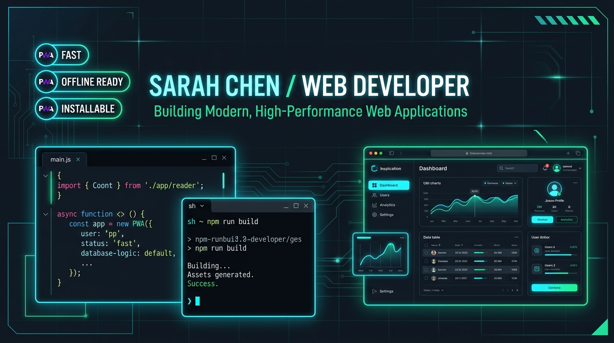
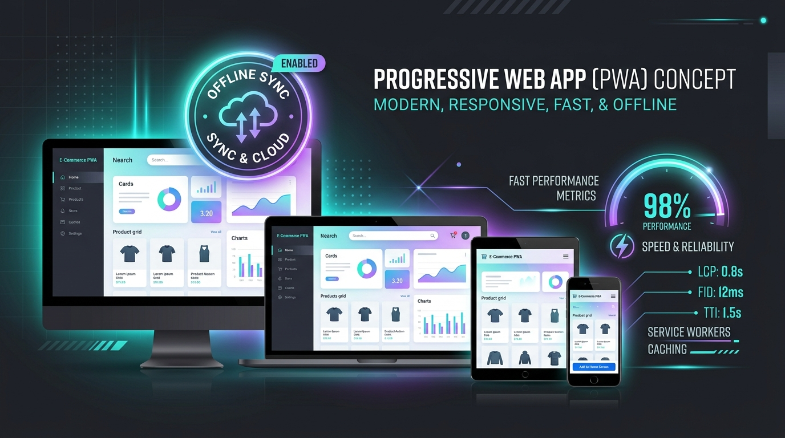
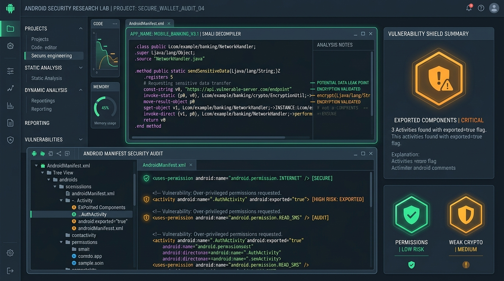

# 📱 Sheikh Farid — Full-Stack & Mobile PWA Portfolio

[](https://react.dev/)
[](https://www.typescriptlang.org/)
[](https://vitejs.dev/)
[](https://tailwindcss.com/)
[](https://web.dev/progressive-web-apps/)
[](https://developer.android.com/)
[](LICENSE)

<div align="center">
  
</div>

An interactive, high-performance **Full-Stack Developer Portfolio** and **Progressive Web Application (PWA)** built by **Sheikh Farid**. Features deep Android WebView bridging, live Smali bytecode disassembly, binary AndroidManifest.xml (AXML) chunk decoding, and an educational **Modern Android Security Safeguards Compendium**.

---

## 🌟 Key Highlights & Core Features

### 1. 🚀 Progressive Web Application (PWA) & Offline Reliability

<div align="center">
  
</div>

- **Full Offline Operation**: Powered by `vite-plugin-pwa` with custom Service Worker caching strategies (`CacheFirst` for static assets, `NetworkFirst` with stale fallback for API/data).
- **In-App Installation Prompt**: Smart install banner triggering standard browser `BeforeInstallPromptEvent` with responsive user feedback.
- **Standalone Display Mode**: Configured with full Web App Manifest (`manifest.webmanifest`), app icons, dynamic theme colors, and cross-platform display properties.

---

### 2. 🤖 Interactive Android WebView & Smali Disassembly Companion

<div align="center">
  
</div>

- **Real-time Smali & Java Inspection**: Interactive modal displaying genuine Dalvik/ART bytecode (`.smali`) and decompiled Java for:
  - `com.pwa.vercel_com` (`MainActivity.java` & Smali)
  - `com.pwa.youtube_com` (`MainActivity.java` & Smali)
  - `com.sand.airdroidkids` (Security Audit Profile)
- **Binary AXML Parser & Chunk Inspector**: Client-side parsing of raw Android Binary XML (`AndroidManifest.xml`), extracting Resource String Tables, Namespace Urns, and Attribute declarations.
- **Interactive WebView Simulator**: Live runtime testbed simulating Android WebView user-agents, JavaScript bridges (`@JavascriptInterface`), cookie syncing, and local cache controls.

---

### 3. 🛡️ AirDroid Kids Security Analysis & Threat Modeling
- **In-Depth Manifest Disassembly**: Dissects over 40 high-privilege permissions (`BIND_ACCESSIBILITY_SERVICE`, `BIND_DEVICE_ADMIN`, `SYSTEM_ALERT_WINDOW`, `RECORD_AUDIO`, `CAMERA`).
- **Ethical Threat Modeling (Dual-Use Analysis)**: Explores legitimate parental supervision vs. unauthorized covert stalkerware vectors (e.g., hidden launcher `KidHideIconActivity_`, secret dialer codes, keystroke monitoring).
- **Defensive Countermeasures**: Outlines concrete technical mitigations across modern Android platforms.

---

### 4. 📚 Modern Android Security Safeguards Compendium
- **Android OS Evolution Timeline**: Covers defensive security milestones from Android 10 (API 29) to Android 15 (API 35+).
- **Interactive Matrix**: Filter by *Privilege & Access Control*, *Anti-Surveillance & Media*, *Storage & Data Transparency*, and *Play Protect Stalkerware Policies*.
- **Direct Manifest Mapping**: Shows how modern OS updates neutralize dangerous legacy privileges:
  - **Android 13+ Restricted Settings**: Neutralizes sideloaded accessibility and notification abuse.
  - **Android 14+ Foreground Service Mandates**: Enforces non-dismissible indicators and hardware privacy dots for camera/mic usage.
  - **Play Protect Stalkerware Bans**: Prohibits launcher hiding and silent background surveillance.
  - **System Photo Picker**: Deprecates bulk `READ_EXTERNAL_STORAGE` in favor of zero-permission, user-selected Content URIs.

---

### 5. 💼 Professional Portfolio & Interactive Showcase
- **Projects Section**: Comprehensive filterable portfolio covering Web, Mobile, Full-Stack, and Security Engineering projects.
- **Work Experience & Skills Matrix**: Detailed interactive breakdowns with proficiency metrics and technology tags.
- **Printable / Downloadable Resume**: Built-in resume viewer modal with one-click print and ATS-friendly layout.
- **Dark / Light Theme Toggle**: Persistent theme switcher with high-contrast accessibility compliance.

---

## 🛠️ Technology Stack

| Layer | Technology |
|---|---|
| **Frontend Framework** | [React 19](https://react.dev/) + [TypeScript](https://www.typescriptlang.org/) |
| **Styling & UI** | [Tailwind CSS v4](https://tailwindcss.com/) with custom dark/light palette |
| **Animations** | [Motion](https://motion.dev/) (Framer Motion v12) |
| **Icons** | [Lucide React](https://lucide.dev/) |
| **PWA & Offline** | [Vite PWA Plugin](https://vite-pwa-org.netlify.app/) (Workbox Service Worker) |
| **Build Tool** | [Vite 8](https://vitejs.dev/) |
| **Backend Server** | [Express](https://expressjs.com/) with [tsx](https://github.com/privatenumber/tsx) & [esbuild](https://esbuild.github.io/) |
| **AI Integration** | [@google/genai](https://github.com/google/generative-ai-js) (Server-side proxy ready) |

---

## 📂 Project Architecture

```plaintext
sheikh-farid-portfolio/
├── index.html                      # Primary HTML entrypoint with SEO & PWA meta
├── metadata.json                   # AI Studio applet specifications
├── package.json                    # Dependencies & build scripts
├── server.ts                       # Express backend server & Vite SSR/dev middleware
├── tsconfig.json                   # TypeScript configuration
├── vite.config.ts                  # Vite, Tailwind CSS v4 & PWA config
├── public/
│   ├── assets/
│   │   └── images/                 # Banner & showcase illustration images
│   ├── icon.svg                    # Vector app icon
│   ├── manifest.webmanifest        # PWA Web App Manifest
│   └── pwa-*.png                   # Progressive Web App icons
└── src/
    ├── App.tsx                     # Main application layout & modal coordination
    ├── main.tsx                    # React client entry point
    ├── index.css                   # Tailwind v4 theme & utility tokens
    ├── types.ts                    # Global TypeScript interfaces & types
    ├── components/
    │   ├── AndroidSecuritySafeguards.tsx # Educational OS defense compendium
    │   ├── AndroidWebViewCompanion.tsx   # Smali disassembler, AXML parser & tester
    │   ├── ContactSection.tsx            # Contact information & message submission
    │   ├── ExperienceSection.tsx         # Career milestones & work history
    │   ├── Footer.tsx                    # Footer with social links & copyright
    │   ├── Hero.tsx                      # Hero banner with call-to-actions
    │   ├── Navbar.tsx                    # Responsive navigation & theme switch
    │   ├── OfflineIndicator.tsx          # Network status detection & offline banner
    │   ├── ProjectsSection.tsx           # Filterable project portfolio grid
    │   ├── PWAInstallButton.tsx          # Smart install action button
    │   ├── ResumeModal.tsx               # Formatted resume with print support
    │   ├── SkillsSection.tsx             # Skill category matrix
    │   └── ThemeToggle.tsx               # Dark/light mode switcher
    └── data/
        ├── airdroidDecompiledData.ts     # AirDroid Kids AXML strings & security audit
        ├── androidSafeguardsData.ts      # Comprehensive modern Android security data
        └── portfolioData.ts              # Personal bio, projects, and smali snippets
```

---

## 🚀 Getting Started

### Prerequisites
- **Node.js** 18.x or higher
- **npm** 9.x or higher (or `bun` / `pnpm`)

### 1. Clone the Repository
```bash
git clone https://github.com/sheikhfarid/portfolio-pwa.git
cd portfolio-pwa
```

### 2. Install Dependencies
```bash
npm install
```

### 3. Environment Setup (Optional)
If server-side Gemini features are enabled, copy `.env.example` to `.env`:
```bash
cp .env.example .env
```
And define your API key:
```env
GEMINI_API_KEY=your_gemini_api_key_here
```

### 4. Run Development Server
```bash
npm run dev
```
Open your browser and navigate to `http://localhost:3000`.

### 5. Production Build & Execution
```bash
# Build client and server bundle
npm run build

# Start production server
npm run start
```

---

## 🔬 Reverse Engineering & Android Companion Guide

1. Click on the **"Android Smali Companion"** badge in the navigation bar or the **"Smali Code" / "Audit & Safeguards"** buttons on relevant project cards.
2. Select an Android profile from the top dropdown:
   - **`com.pwa.vercel_com`**: Pure WebView PWA host app with WebSettings cache optimization.
   - **`com.pwa.youtube_com`**: Media-centric Android WebView wrapper.
   - **`com.sand.airdroidkids`**: Deep security disassembly audit.
3. Switch between tabs:
   - **Smali Code**: Examine genuine register-level Dalvik bytecode instructions.
   - **Decompiled Java**: Review reconstructed Android Java source code.
   - **Manifest XML & AXML Parser**: Inspect decoded manifest elements and analyze binary string tables.
   - **Security Audit**: Review threat modeling, dual-use risk vectors, and ethical implications.
   - **Modern OS Safeguards**: Explore how Android 10 through 15 neutralize intrusive background behaviors.
   - **Runtime Tester**: Emulate WebView header injection and bridge method invocations.

---

## 🛡️ Security & Ethical Research Notice

The decompilation analysis and bytecode demonstrations contained within this project are intended solely for **educational, defensive security research, and architectural illustration**:
- They highlight the difference between transparent parental tools and abusive stalkerware patterns.
- All demonstrations respect Google Play Developer Policies and promote modern Android OS privacy frameworks (Scoped Storage, Restricted Settings, Runtime Permissions).

---

## 👨‍💻 About Sheikh Farid

- **Role**: Full-Stack Engineer & Mobile PWA Specialist
- **Location**: Dhaka, Bangladesh (Available Globally)
- **Specialization**: React 19, TypeScript, Progressive Web Apps, Android WebViews, Express, Cloud Architecture
- **Email**: [sheikhfaridvisa164@gmail.com](mailto:sheikhfaridvisa164@gmail.com)
- **Portfolio**: [https://vercel.com/portfolio-b9415115](https://vercel.com/portfolio-b9415115)

---

## 📄 License

This project is licensed under the [MIT License](LICENSE) — feel free to use and adapt this code for your own portfolio or learning journey.
